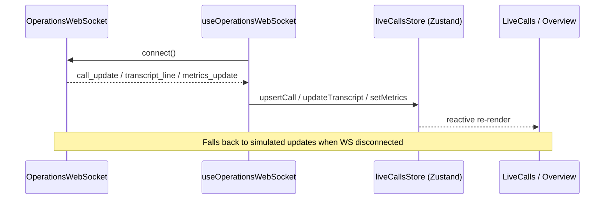

# Enterprise Admin Dashboard

The VOXERA Admin Dashboard is the primary operating console for enterprise customers — designed for daily use by operations teams, supervisors, and platform administrators.

## Architecture

```
┌─────────────────────────────────────────────────────────────────────────────┐
│                         React 18 + Vite + TypeScript                         │
├─────────────────────────────────────────────────────────────────────────────┤
│  Pages (lazy-loaded)          │  Design System (components/ui)               │
│  Overview · Live Calls ·      │  Button · Card · Table · MetricCard ·         │
│  Agents · Knowledge ·         │  Timeline · LogViewer · Drawer · Progress   │
│  Workflows · Tools ·          │                                             │
│  Tenants · Users · Analytics  │                                             │
├───────────────────────────────┴─────────────────────────────────────────────┤
│  State: Zustand (live calls) · TanStack Query (API) · React Context (auth)  │
├─────────────────────────────────────────────────────────────────────────────┤
│  Real-time: OperationsWebSocket → liveCallsStore → UI (no page refresh)    │
├─────────────────────────────────────────────────────────────────────────────┤
│  API: lib/api/client.ts → VITE_API_URL / Vite proxy /api/v1                 │
└─────────────────────────────────────────────────────────────────────────────┘
```

## Layout

```
┌──────────┬──────────────────────────────────────────────────────────────┐
│ Sidebar  │  Header (org · env · theme · notifications · user)           │
│          ├──────────────────────────────────────────────────────────────┤
│ Dashboard│  Breadcrumbs · PageHeader · Main workspace                   │
│ Live     │                                                              │
│ Agents   │                                                              │
│ ...      ├──────────────────────────────────────────────────────────────┤
│          │  Footer                                                      │
└──────────┴──────────────────────────────────────────────────────────────┘
```

- **Desktop-first**, responsive with mobile drawer sidebar
- **Dark & light themes** via `ThemeContext` + shared tokens (`shared/ui/tokens.css`)
- **WCAG AA**: skip link, focus rings, ARIA on tabs/tables/logs, keyboard navigation

## Navigation

| Section | Route | Purpose |
|---------|-------|---------|
| Dashboard | `/app` | KPIs, system health, recent activity |
| Live calls | `/app/live-calls` | Real-time call center + supervisor controls |
| Call details | `/app/calls/:id` | Full timeline, transcript, planner/verifier/tools |
| AI agents | `/app/agents` | Agent cards, create/edit/clone |
| Knowledge | `/app/knowledge` | Upload, indexing, search |
| Workflows | `/app/workflows` | Visual workflow viewer |
| Tool registry | `/app/tools` | Tool health, latency, permissions |
| Analytics | `/app/analytics` | Charts and trends |
| Tenants | `/app/tenants` | Multi-tenant management |
| Users | `/app/users` | RBAC, invites, sessions |
| Billing | `/app/billing` | Plans, usage, invoices |
| Audit logs | `/app/audit-log` | Searchable audit trail |
| Developer | `/app/developer` | API keys, webhooks |
| Settings | `/app/settings` | Profile, security, integrations |

## Real-Time Architecture



Configure WebSocket URL:

```bash
VITE_WS_URL=ws://localhost:8000/api/v1/ws/operations
```

## State Management Guide

| Layer | Tool | Usage |
|-------|------|-------|
| Server data | TanStack Query | API fetches, caching, refetch |
| Live operations | Zustand | Active calls, metrics, WS status |
| Auth / org / billing | React Context | Session-scoped app state |
| Forms | React Hook Form + Zod | Validated forms (ready for integration) |

### liveCallsStore

```typescript
import { useLiveCallsStore, useSelectedCall } from "@/stores/liveCallsStore";

const calls = useLiveCallsStore((s) => s.calls);
const metrics = useLiveCallsStore((s) => s.metrics);
const selected = useSelectedCall();
```

## API Client

```typescript
import { api } from "@/lib/api/client";

const workflows = await api.get("/tenants/{id}/agents/{aid}/workflow", {
  tenantId: "uuid",
});
```

Dev proxy: `vite.config.ts` proxies `/api` → `http://localhost:8000`.

## Component Library

Located in `src/components/ui/`:

| Component | Purpose |
|-----------|---------|
| Button | primary, secondary, ghost, danger, outline |
| Card | CardHeader, CardContent |
| Badge | status chips |
| Table | accessible data tables |
| StatCard / MetricCard | KPI display |
| Timeline | event timelines |
| LogViewer | monospace log stream with auto-scroll |
| Drawer | right-panel overlay |
| SearchInput | search with icon |
| Progress | usage bars |
| Tooltip | hover hints |
| ErrorState / EmptyState / Skeleton | feedback states |
| Tabs | accessible tab panels |

Domain components:

- `components/calls/` — LiveCallCard, TranscriptPanel, SupervisorControls
- `components/dashboard/` — ActivityFeed, SystemHealthBadge
- `components/workflows/` — WorkflowViewer

## Folder Structure

```
dashboard/src/
├── components/
│   ├── ui/              # Design system
│   ├── layout/          # Shell (Sidebar, Header, …)
│   ├── calls/           # Live call center
│   ├── dashboard/       # Dashboard widgets
│   └── workflows/       # Workflow viewer
├── contexts/            # Auth, org, billing, agents, …
├── data/                # Operations mock data (dev fallback)
├── hooks/               # useOperationsWebSocket
├── lib/                 # api, billing, websocket, queryClient
├── pages/               # Route pages (lazy loaded)
├── stores/              # Zustand stores
├── types/               # Shared + operations types
└── test/                # Vitest setup
```

## Performance

- **Code splitting**: all `/app/*` pages lazy-loaded via `React.lazy`
- **Memoization**: Zustand selectors prevent unnecessary re-renders
- **Streaming updates**: WebSocket + simulated fallback for dev
- **Framer Motion**: subtle transcript animations only

## Testing

```bash
cd dashboard
npm run test        # Vitest unit tests
npm run build       # TypeScript + production build
```

Tests cover: `MetricCard`, `cn` utility, billing plan helpers.

## Environment Variables

```bash
VITE_API_URL=http://localhost:8000/api/v1
VITE_WS_URL=ws://localhost:8000/api/v1/ws/operations
```

## Design Principles

- Premium, minimal, enterprise-grade (Datadog / Stripe / Cloudflare aesthetic)
- No glassmorphism or excessive gradients
- Generous spacing, excellent typography (Inter)
- Professional palette from shared design tokens
