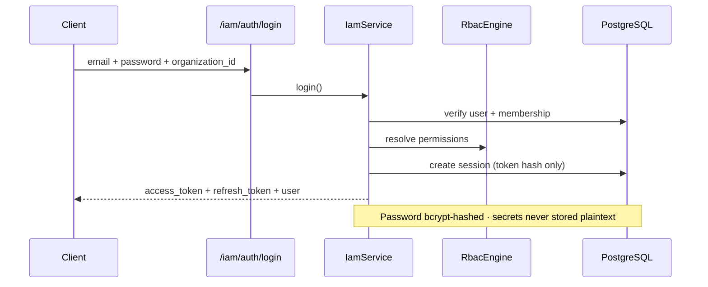
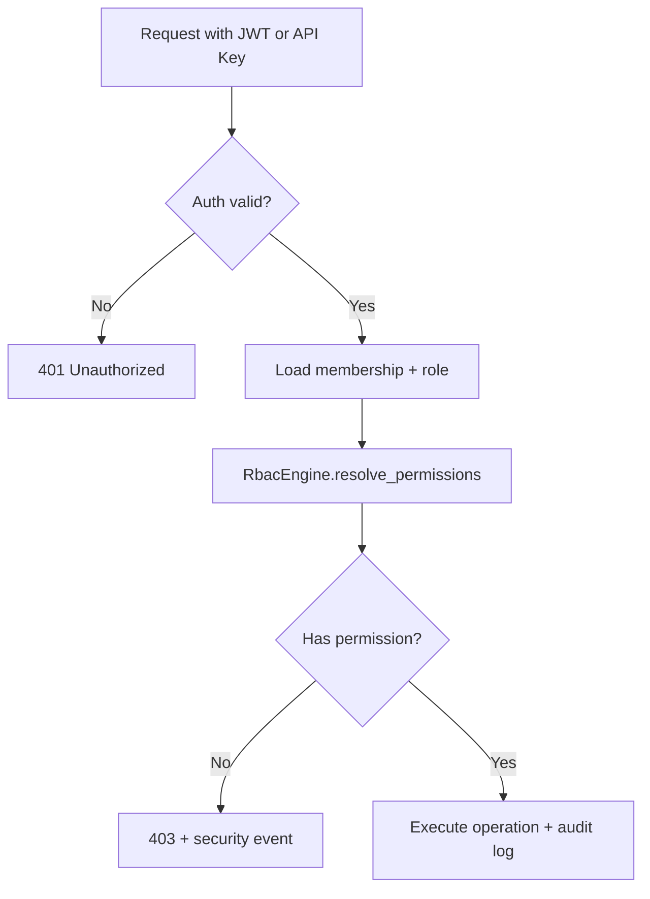

# Enterprise Identity & Access Management

VOXERA IAM is a full enterprise identity platform — not demo authentication. It supports organizations, users, RBAC, API keys, sessions, security policies, audit, compliance abstractions, SSO/OAuth/MFA provider ports, and zero-trust design.

## Architecture

```
┌─────────────────────────────────────────────────────────────────────────────┐
│                         /api/v1/iam/auth · /api/v1/iam                      │
├─────────────────────────────────────────────────────────────────────────────┤
│  IamService → IamServiceImpl                                                 │
├──────────┬──────────┬──────────┬──────────┬──────────┬──────────────────────┤
│ Auth     │ RBAC     │ API Keys │ Sessions │ Policies │ Audit + Security     │
│ JWT      │ Engine   │ HMAC     │ Tracking │ Engine   │ Events (immutable)   │
├──────────┴──────────┴──────────┴──────────┴──────────┴──────────────────────┤
│  OAuth / SSO / MFA — provider abstractions (Okta, Entra, Google, Auth0…)    │
│  SecretProvider — local · AWS · Azure · GCP · Vault                          │
└─────────────────────────────────────────────────────────────────────────────┘
```

## Authentication Flow



## Authorization Flow (RBAC)



## System Roles

| Role | Description |
|------|-------------|
| `owner` | Full organization control |
| `administrator` | All except org ownership transfer |
| `supervisor` | Approvals, agents, workflows |
| `manager` | Team operations, workflow approval |
| `agent` | Call handling, tools |
| `developer` | API keys, agents, integrations |
| `billing` | Billing and usage |
| `security_auditor` | Audit logs, security policies |
| `viewer` | Read-only access |

Custom roles per organization with inheritance and configurable permissions.

## Permissions

Fine-grained slugs: `view_calls`, `delete_calls`, `manage_agents`, `manage_knowledge`, `manage_billing`, `view_audit_logs`, `execute_tools`, `approve_workflows`, `manage_users`, `manage_api_keys`, `manage_roles`, `manage_security`, `manage_organization`, `view_analytics`.

## API Reference

### Authentication

| Method | Path | Description |
|--------|------|-------------|
| POST | `/iam/auth/login` | Email + password login |
| POST | `/iam/auth/magic-link` | Magic link (provider stub) |
| GET | `/iam/auth/permissions` | Permission catalog |

### Organizations

| Method | Path | Description |
|--------|------|-------------|
| POST | `/iam/organizations` | Provision organization (links to tenant) |
| GET | `/iam/organizations/{id}` | Get organization |
| POST | `/iam/organizations/{id}/users` | Register user |
| POST | `/iam/organizations/{id}/users/invite` | Invite user |
| GET | `/iam/organizations/{id}/users` | List users |
| GET/POST | `/iam/organizations/{id}/roles` | List / create roles |
| GET/POST/DELETE | `/iam/organizations/{id}/api-keys` | API key management |
| GET/PATCH | `/iam/organizations/{id}/security-policy` | Security policies |
| GET | `/iam/organizations/{id}/audit-logs` | IAM audit trail |
| GET | `/iam/organizations/{id}/metrics` | IAM observability |

### Sessions

| Method | Path | Description |
|--------|------|-------------|
| GET | `/iam/users/{id}/sessions` | List sessions |
| DELETE | `/iam/sessions/{id}` | Revoke session |

## Database Schema (Migration 008)

| Table | Purpose |
|-------|---------|
| `organizations` | 1:1 tenant IAM profile |
| `iam_users` | Global user identity |
| `organization_memberships` | User ↔ org ↔ role |
| `iam_roles` | System + custom roles |
| `iam_api_keys` | Hashed API keys |
| `iam_sessions` | Active auth sessions |
| `iam_security_policies` | Per-org security config |
| `iam_security_events` | Failed logins, violations |
| `iam_audit_logs` | Immutable IAM audit |
| `oauth_identities` | OAuth links |
| `sso_providers` | SAML/OIDC config (encrypted) |
| `mfa_factors` | TOTP/SMS/email/WebAuthn |
| `compliance_settings` | GDPR, HIPAA, SOC2, etc. |

## Security

- **Passwords**: bcrypt hashed, never plaintext
- **API keys**: HMAC-SHA256 with SECRET_KEY; full key shown once at creation
- **Sessions**: token hashes stored, not raw JWTs
- **Field encryption**: LocalSecretProvider (Vault/AWS/Azure/GCP-ready)
- **Audit**: append-only `iam_audit_logs`
- **Security events**: login failures, permission denials, policy violations

## Configuration

```bash
IAM_ACCESS_TOKEN_EXPIRE_MINUTES=60
IAM_REFRESH_TOKEN_EXPIRE_DAYS=30
IAM_SESSION_MAX_CONCURRENT=10
IAM_API_KEY_PREFIX=vx_
IAM_PASSWORD_MIN_LENGTH=12
IAM_SECRET_PROVIDER=local
```

## Folder Structure

```
app/iam/
├── api/              # REST routes
├── auth/             # Password, JWT, MFA providers
├── authorization/    # RBAC engine
├── organizations/    # Org domain (via service)
├── users/            # User domain
├── roles/            # Custom roles
├── permissions/      # Permission catalog
├── policies/         # Security policy engine
├── sessions/         # Session management
├── api_keys/         # Key crypto
├── oauth/            # OAuth provider abstraction
├── sso/              # SSO provider abstraction
├── audit/            # Immutable audit
├── compliance/       # GDPR, HIPAA, SOC2 abstractions
├── security/         # Secret provider, events
├── metrics/          # Observability
├── services/         # IamService facade
├── repository/       # Ports
└── validators/       # Access validation
```

## Developer Guide

### Check permission programmatically

```python
allowed = await iam_service.check_permission(org_id, user_id, "manage_agents")
```

### Create API key (secret shown once)

```python
result = await iam_service.create_api_key(org_id, ApiKeyCreate(name="Production"), created_by=user_id)
print(result.secret)  # Store immediately — never retrievable again
```

### Register custom OAuth/SSO provider

Implement `OAuthProviderBase` or `SsoProviderBase` and register in factory.

## Future Ready

- Visual role editor (dashboard)
- ABAC attribute policies
- WebAuthn passwordless
- Customer-managed encryption keys
- Multi-region session replication
