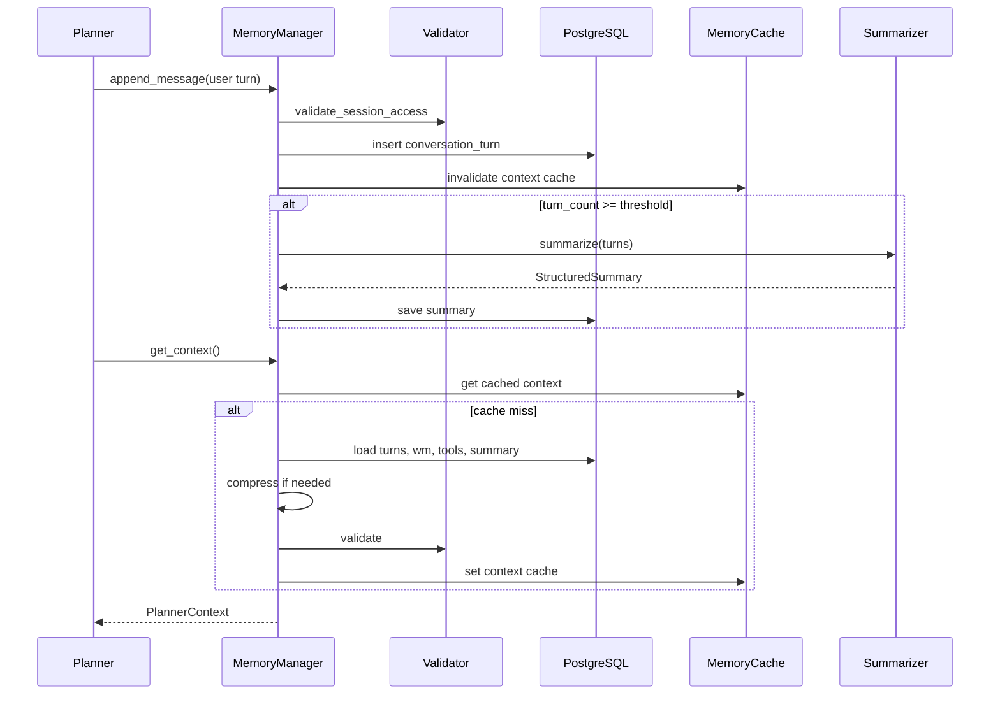

# Enterprise Memory System

VOXERA's memory layer enables multi-turn voice agents to remember conversation context, working state, tool outputs, and structured summaries — with strict tenant isolation and token-efficient context assembly for the Planner LLM.

## Architecture Diagram

```
┌─────────────────────────────────────────────────────────────────────────────┐
│              POST/GET /tenants/{tid}/agents/{aid}/memory/*                   │
└───────────────────────────────────┬─────────────────────────────────────────┘
                                    ▼
┌─────────────────────────────────────────────────────────────────────────────┐
│                         MemoryManager (single Planner port)                  │
│                                                                              │
│  create_session · append_message · append_tool_result · update_state         │
│  set_working_memory · get_context · generate_summary · clear_session         │
└───────┬───────────────┬────────────────┬────────────────┬───────────────────┘
        │               │                │                │
        ▼               ▼                ▼                ▼
┌──────────────┐ ┌──────────────┐ ┌─────────────┐ ┌─────────────────────────┐
│ Conversation │ │ Working      │ │ Tool        │ │ Summary + Knowledge     │
│ Memory       │ │ Memory       │ │ Memory      │ │ Memory (cache-backed)   │
│ (turns DB)   │ │ (KV DB)      │ │ (exec DB)   │ │                         │
└──────────────┘ └──────────────┘ └─────────────┘ └─────────────────────────┘
        │               │                │                │
        └───────────────┴────────────────┴────────────────┘
                                    ▼
                    ┌───────────────────────────────┐
                    │ MemoryAccessValidator         │
                    │ (tenant · agent · session)    │
                    └───────────────────────────────┘
                                    ▼
                    ┌───────────────────────────────┐
                    │ PlannerContextAssembler       │
                    │ → PlannerContext              │
                    └───────────────────────────────┘
```

## Session Lifecycle

```
create_session()
      │
      ▼
 CALL_STARTED ──▶ IDENTITY_PENDING ──▶ IDENTITY_VERIFIED
      │                                      │
      │                                      ▼
      │                              RETRIEVAL_RUNNING
      │                                      │
      │                                      ▼
      │                              TOOL_EXECUTION ◀──┐
      │                                      │         │
      │                                      ▼         │
      │                          WAITING_CONFIRMATION  │
      │                                      │         │
      │                                      ▼         │
      │                                 ESCALATED      │
      │                                      │         │
      └──────────────────────────────────────┴─────────┘
                                           │
                                           ▼
                                   CALL_COMPLETED
                                           │
                                           ▼
                              clear_session() / archive()
                                           │
                                           ▼
                              Working memory cleared
                              Session status: ARCHIVED
```

## Sequence Diagram



## Folder Structure

```
app/memory/
├── api/routes.py              # Thin REST endpoints
├── schemas/                   # Pydantic DTOs + PlannerContext
├── repository/              # Repository ABCs
├── interfaces/memory_types.py # Conversation, Working, Session, Tool, … ports
├── manager/memory_manager.py  # MemoryManager ABC
├── summarizer/              # StructuredConversationSummarizer
├── compression/             # MemoryCompressor
├── cache/                   # MemoryCache + InMemoryMemoryCache
├── validators/              # MemoryAccessValidator
├── state/                   # PlannerContextAssembler
├── session/                 # Session lifecycle helpers (via manager)
├── services/                # Service ports
└── metrics/                 # MemoryMetricsCollector

app/infrastructure/memory/
├── memory_manager.py        # MemoryManagerImpl
├── factory.py               # DI wiring
└── knowledge_memory.py      # CachedKnowledgeMemory
```

## Memory Types

| Type | Storage | Lifecycle |
|------|---------|-----------|
| Conversation Memory | `conversation_turns` | Full session |
| Working Memory | `working_memory` | Cleared on `clear_session()` |
| Session Memory | `conversations.current_state` | Session-scoped |
| Tool Memory | `tool_executions` | Session-scoped |
| Knowledge Memory | MemoryCache | TTL-based snapshots |
| Summary Memory | `conversation_summaries` | Regenerated on threshold |
| Long-Term Memory | Interface only | Future sprint |

## PlannerContext Assembly

`get_context()` returns a single structured object:

- Current user message
- Conversation summary (not full transcript)
- Working memory (sensitive fields redacted)
- Retrieved knowledge excerpts (attached externally)
- Tool execution results
- Agent configuration + tenant policies
- Current session state + language

## API Endpoints

Base: `/api/v1/tenants/{tenant_id}/agents/{agent_id}/memory`

| Method | Path | Description |
|--------|------|-------------|
| `GET` | `/session?conversation_id=` | Session metadata + state |
| `GET` | `/history?conversation_id=` | Conversation turns |
| `GET` | `/summary?conversation_id=` | Structured summary |
| `GET` | `/context?conversation_id=` | Full PlannerContext |
| `DELETE` | `/session?conversation_id=` | Clear working memory + complete session |
| `GET` | `/metrics?conversation_id=` | Memory observability snapshot |

## Security

Every operation validates `tenant_id`, `agent_id`, and `conversation_id`. Cross-tenant access raises `CrossTenantMemoryError`. Expired or completed sessions are rejected for writes. Sensitive working memory values are redacted in context output.

## Configuration

```env
MEMORY_MAX_CONTEXT_TOKENS=8192
MEMORY_SUMMARY_TURN_THRESHOLD=12
MEMORY_COMPRESSION_ENABLED=true
MEMORY_CACHE_TTL_SECONDS=300
MEMORY_WORKING_MEMORY_TTL_SECONDS=3600
MEMORY_SESSION_EXPIRY_HOURS=24
```

## Developer Guide

### Creating a session

```python
from app.memory.schemas import CreateSessionRequest

session = await memory_manager.create_session(
    CreateSessionRequest(tenant_id=tid, agent_id=aid, language="en")
)
```

### Appending turns

```python
from app.memory.schemas import AppendMessageRequest
from app.core.enums import MemoryRole

await memory_manager.append_message(
    tid, aid, session.id,
    AppendMessageRequest(role=MemoryRole.USER, message="I need my order status"),
)
```

### Getting Planner context

```python
context = await memory_manager.get_context(
    tid, aid, session.id,
    retrieved_knowledge=["Refund policy: 30 days."],
    agent_configuration={"tone": "professional"},
)
# Pass context to Planner LLM — do not use raw transcript
```

### Integration boundary

The Planner communicates **only** with `MemoryManager`. It must not access repositories, cache, or database directly. The RAG engine remains separate — pass retrieved excerpts into `get_context(retrieved_knowledge=...)`.

## Migration

```bash
alembic upgrade head  # applies 003_enterprise_memory
```

## What Was Not Modified

- WebSocket / voice streaming pipeline
- Twilio telephony
- STT / LLM / TTS consumers
- Enterprise Retrieval Engine (`app/rag/`)
