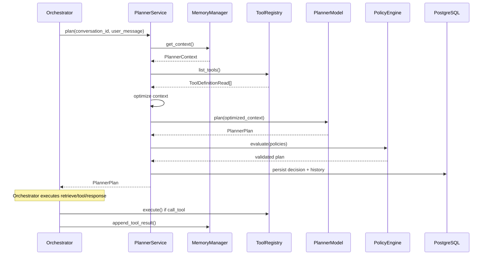

# Enterprise Planner Agent

The Planner Agent is VOXERA's decision-making brain. It receives conversation context and produces **strict structured JSON plans** — never executing tools, retrieving documents, or speaking directly to customers.

## Architecture

```
┌─────────────────────────────────────────────────────────────────────────────┐
│              POST /tenants/{tid}/agents/{aid}/planner/plan                  │
└───────────────────────────────────┬─────────────────────────────────────────┘
                                    ▼
┌─────────────────────────────────────────────────────────────────────────────┐
│                         PlannerService (orchestrator)                        │
│  Reads: MemoryManager.get_context · ToolRegistry.list_tools                  │
│  Never: ToolRegistry.execute · RAG · databases · filesystem                  │
└───────┬───────────────┬────────────────┬────────────────┬───────────────────┘
        │               │                │                │
        ▼               ▼                ▼                ▼
┌──────────────┐ ┌──────────────┐ ┌─────────────┐ ┌─────────────────────────┐
│ Context      │ │ IntentEngine │ │ PolicyEngine│ │ PlannerModel            │
│ Optimizer    │ │ ReasoningLoop│ │             │ │ (Structured / LLM)      │
└──────────────┘ └──────────────┘ └─────────────┘ └─────────────────────────┘
                                    ▼
                    ┌───────────────────────────────┐
                    │ PlannerPlan (structured JSON)    │
                    │ → Orchestrator executes actions  │
                    └───────────────────────────────┘
```

## Reasoning Flow

```
Planner Input
     │
     ▼
Evaluate Context (optimized)
     │
     ├─ Need Knowledge? ──▶ action: retrieve
     │
     ├─ Need Tool? ──▶ action: call_tool (request only)
     │
     ├─ Need Clarification? ──▶ action: ask_clarification
     │
     ├─ Need Human? ──▶ action: transfer_human / escalate
     │
     └─ Done? ──▶ action: respond / end_conversation
```

## Sequence Diagram



## Planner Input

Assembled from `PlannerContext` + available tools + planner history:

- Current user message
- Conversation summary
- Working memory
- Retrieved knowledge
- Available tools (metadata only)
- Agent configuration
- Tenant policies
- Session state
- Tool results
- Language

## Planner Output (`PlannerPlan`)

Strict JSON — never unstructured free text:

```json
{
  "intent": "appointment",
  "confidence": 0.90,
  "reasoning": ["User wants appointment", "Identity verification required"],
  "next_action": "verify_identity",
  "action": "respond",
  "tool_call": null,
  "response": "Certainly. May I have your registered email?",
  "plan": {
    "goal": "Book or manage customer appointment",
    "required_information": ["customer_name", "preferred_datetime"],
    "missing_information": ["email"],
    "execution_plan": ["Verify identity", "Book appointment"],
    "expected_tool": "appointment",
    "risk_level": "low",
    "completion_criteria": "Appointment confirmed"
  },
  "status": "completed",
  "language": "en"
}
```

## Supported Actions

| Action | Description |
|--------|-------------|
| `respond` | Generate customer-facing response |
| `retrieve` | Request knowledge retrieval (orchestrator calls RAG) |
| `call_tool` | Request tool execution (orchestrator calls ToolRegistry) |
| `ask_clarification` | Request missing information |
| `escalate` | Escalate with ticket/notification |
| `transfer_human` | Transfer to human agent |
| `end_conversation` | Close session |

## Folder Structure

```
app/planner/
├── api/routes.py           # REST endpoints
├── services/               # PlannerService port
├── interfaces/             # PlannerModel ABC
├── models/                 # StructuredPlannerModel (+ future LLM providers)
├── reasoning/              # IntentEngine, ReasoningLoop
├── planning/               # PlanningEngine
├── prompts/                # TemplatePromptProvider (no hardcoded prompts in logic)
├── policies/               # PolicyEngine
├── state/                  # ContextOptimizer
├── validators/             # Output + access validation
├── cache/                  # PlannerCache (Redis-ready)
├── metrics/                # PlannerMetricsCollector
├── schemas/                # PlannerPlan, PlannerInput DTOs
└── repository/             # Session, decision, history ABCs
```

## API Endpoints

Base: `/api/v1/tenants/{tenant_id}/agents/{agent_id}/planner`

| Method | Path | Description |
|--------|------|-------------|
| `POST` | `/plan` | Generate structured plan |
| `GET` | `/history` | Reasoning history |
| `GET` | `/decisions` | Past decisions |
| `GET` | `/metrics` | Observability snapshot |

## Model Abstraction

`PlannerModel` interface supports future providers:

- `structured` (default, production-ready rule engine)
- `openai`, `anthropic`, `gemini`, `azure`, `groq`, `local` (future)

Methods: `plan()`, `health()`, `estimate_tokens()`

## Configuration

```env
PLANNER_MAX_REASONING_STEPS=5
PLANNER_MIN_CONFIDENCE=0.55
PLANNER_CACHE_TTL_SECONDS=300
PLANNER_MAX_CONTEXT_TOKENS=6144
PLANNER_ENABLE_CACHE=true
PLANNER_MODEL_PROVIDER=structured
PLANNER_ESCALATION_CONFIDENCE_THRESHOLD=0.40
```

## Developer Guide

### Generate a plan

```python
from app.planner.schemas import PlanRequest

plan = await planner_service.plan(
    tenant_id, agent_id,
    PlanRequest(
        conversation_id=session_id,
        user_message="I need to book an appointment",
        tenant_policies={"blocked_tools": ["refund"]},
    ),
)

if plan.action == "call_tool" and plan.tool_call:
    # Orchestrator executes — NOT the planner
    result = await tool_registry.execute(tenant_id, agent_id, ...)
    await memory_manager.append_tool_result(...)
elif plan.action == "retrieve":
    rag_result = await rag_service.execute(...)
    # Re-plan with retrieved knowledge
```

### Security boundaries

The Planner **never**:
- Accesses databases directly
- Calls APIs or executes tools
- Reads filesystem
- Accesses other tenants' data

## Migration

```bash
alembic upgrade head  # applies 005_enterprise_planner
```

## Unmodified Systems

- Voice streaming pipeline (Twilio, STT, LLM, TTS)
- Memory Manager implementation
- Tool Registry implementation
- Enterprise RAG engine
