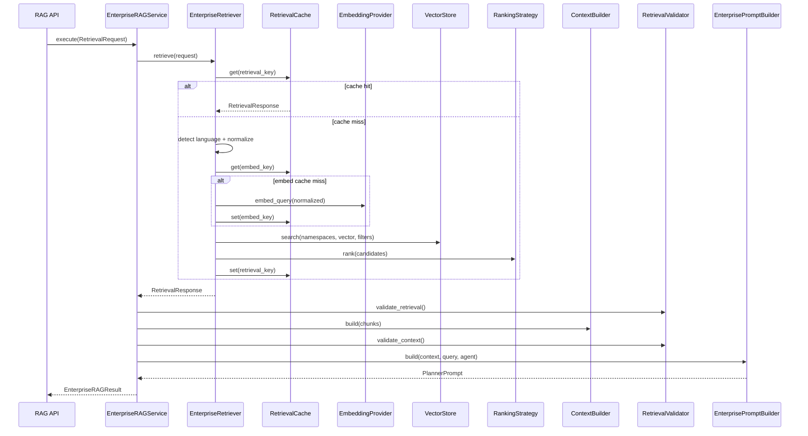

# Enterprise Retrieval Engine Architecture

The VOXERA Enterprise Retrieval Engine (`app/rag/`) is the security-critical layer that ensures **every AI response is grounded exclusively in tenant-owned knowledge**. It sits between the knowledge ingestion pipeline and the Planner LLM without modifying the voice streaming stack.

## Design Goals

| Goal | Mechanism |
|------|-----------|
| No cross-tenant access | Tenant-scoped repos, vector namespaces, validation gate |
| No hallucination | Validated context only; safety instructions in prompt |
| Low latency | Embedding + retrieval cache; performance targets per stage |
| Enterprise-grade | Clean architecture, DI, structured metrics, extensible ranking |
| Future scale | Abstract cache (Redis-ready), abstract rankers, horizontal vector DB |

## Architecture Diagram

```
┌─────────────────────────────────────────────────────────────────────────────┐
│                    POST /tenants/{tid}/agents/{aid}/rag/query                │
└───────────────────────────────────┬─────────────────────────────────────────┘
                                    ▼
┌─────────────────────────────────────────────────────────────────────────────┐
│                        EnterpriseRAGService (orchestrator)                   │
│                                                                              │
│  ┌─────────────┐   ┌──────────────┐   ┌─────────────┐   ┌─────────────────┐ │
│  │  Language   │──▶│    Query     │──▶│  Embedding  │──▶│  Vector Search  │ │
│  │  Detection  │   │ Normalization│   │  (+ cache)  │   │  (per namespace)│ │
│  └─────────────┘   └──────────────┘   └─────────────┘   └────────┬────────┘ │
│                                                                    ▼         │
│  ┌─────────────┐   ┌──────────────┐   ┌─────────────┐   ┌─────────────────┐ │
│  │   Prompt    │◀──│   Context    │◀──│ Validation  │◀──│ RankingStrategy │ │
│  │   Builder   │   │   Builder    │   │   Gate      │   │ (+ metadata filt)│ │
│  └─────────────┘   └──────────────┘   └─────────────┘   └─────────────────┘ │
└─────────────────────────────────────────────────────────────────────────────┘
                                    │
                    Uses (does not modify)
                                    ▼
┌──────────────────────────┐  ┌──────────────────────────┐
│  EmbeddingProvider       │  │  VectorStore             │
│  (app/knowledge)         │  │  (app/knowledge)         │
└──────────────────────────┘  └──────────────────────────┘
```

## Retrieval Flow Diagram

```
Customer Question
       │
       ▼
┌──────────────────┐
│ Language Detect  │  HeuristicLanguageDetector (swap for CLD3/fastText)
└────────┬─────────┘
         ▼
┌──────────────────┐
│ Query Normalize  │  NFKC, whitespace, punctuation trim
└────────┬─────────┘
         ▼
┌──────────────────┐     cache miss
│ Embed Query      │────────────────▶ EmbeddingProvider.embed_query()
└────────┬─────────┘
         ▼
┌──────────────────┐
│ Vector Search    │  tenant-isolated namespaces, metadata filters
└────────┬─────────┘
         ▼
┌──────────────────┐
│ Metadata Filter  │  department, product, language, version, document, …
└────────┬─────────┘
         ▼
┌──────────────────┐
│ Rank Chunks      │  CosineSimilarity (default) | Hybrid | MMR | RRF | …
└────────┬─────────┘
         ▼
┌──────────────────┐
│ Context Builder  │  merge, dedupe, token budget
└────────┬─────────┘
         ▼
┌──────────────────┐
│ Validate         │  tenant, agent, similarity, language, injection
└────────┬─────────┘
         ▼
┌──────────────────┐
│ Prompt Builder   │  structured sections — never raw documents
└────────┬─────────┘
         ▼
    Planner LLM  (future integration — not wired to voice pipeline yet)
```

## Sequence Diagram



## Folder Structure & Class Responsibilities

```
app/rag/
├── interfaces/
│   ├── models.py           # RetrievalRequest, RankedChunk, PlannerPrompt, …
│   ├── retriever.py        # EnterpriseRetriever ABC
│   └── agent_scope.py      # AgentKnowledgeScope ABC
├── retriever/
│   ├── enterprise_retriever.py   # EnterpriseRetrieverImpl
│   ├── normalizer.py             # QueryNormalizer
│   └── language_detector.py      # LanguageDetector ABC + heuristic impl
├── ranking/
│   └── strategies.py       # RankingStrategy ABC + Cosine + future stubs
├── context/
│   ├── builder.py          # ContextBuilder — merge, dedupe, token budget
│   └── conversation.py     # ConversationContextMerger
├── prompt_builder/
│   └── enterprise.py       # EnterprisePromptBuilder
├── cache/
│   └── base.py             # RetrievalCache ABC + InMemoryRetrievalCache
├── validators/
│   ├── retrieval_validator.py  # Security gate before LLM
│   └── sanitizer.py            # Prompt injection filtering
├── metrics/
│   └── collector.py        # RetrievalMetricsCollector
├── services/
│   └── enterprise_rag_service.py  # Pipeline orchestrator
└── api/routes.py           # Thin REST endpoint

app/infrastructure/rag/
├── factory.py              # DI wiring
└── agent_scope.py          # SqlAlchemyAgentKnowledgeScope
```

| Class | Responsibility |
|-------|----------------|
| `EnterpriseRetrieverImpl` | Embedding, vector search, metadata filter, ranking |
| `ContextBuilder` | Merge chunks, remove duplicates, enforce token budget |
| `EnterprisePromptBuilder` | Structured Planner prompt with safety instructions |
| `RetrievalValidator` | Tenant/agent/similarity/language/injection checks |
| `RetrievalCache` | Cache embeddings, retrieval results (Redis-ready port) |
| `RankingStrategy` | Pluggable re-ranking (Cosine default; Hybrid/MMR/RRF stubs) |
| `EnterpriseRAGService` | Full pipeline orchestration + metrics |

## Performance Targets

| Stage | Target | Config |
|-------|--------|--------|
| Vector search | < 100ms | `RAG_VECTOR_SEARCH_TARGET_MS` |
| Context building | < 30ms | `RAG_CONTEXT_BUILD_TARGET_MS` |
| Prompt generation | < 20ms | `RAG_PROMPT_BUILD_TARGET_MS` |

All stages emit structured latency metrics via `RetrievalMetricsCollector`.

## Security Controls

- **Tenant isolation**: `tenant_id` enforced in DB queries, vector metadata, and validation
- **Agent authorization**: Active agent required; `AgentKnowledgeScope` resolves allowed sources
- **Inactive document rejection**: Only `READY` knowledge sources pass validation
- **Similarity threshold**: Configurable minimum (`RAG_MIN_SIMILARITY_THRESHOLD`)
- **Prompt injection defense**: `PromptInjectionSanitizer` + validation gate
- **No raw documents in prompts**: Formatted excerpts only via `ContextBuilder`

## API

```
POST /api/v1/tenants/{tenant_id}/agents/{agent_id}/rag/query
```

Request body: `RetrievalRequest` (set `include_prompt: true` for full Planner prompt)

## Configuration

```env
RAG_CACHE_TTL_SECONDS=300
RAG_EMBEDDING_CACHE_TTL_SECONDS=3600
RAG_MAX_CONTEXT_TOKENS=4096
RAG_MIN_SIMILARITY_THRESHOLD=0.65
RAG_DEFAULT_TOP_K=8
RAG_ENABLE_RETRIEVAL_CACHE=true
```

## What Was Not Modified

- WebSocket endpoint and streaming pipeline
- Twilio telephony handler
- STT, LLM, TTS consumers

## Future Integration

The voice runtime will call `EnterpriseRAGService.execute()` before Planner LLM invocation — injecting `PlannerPrompt.full_prompt` without changing the WebSocket receive loop.
