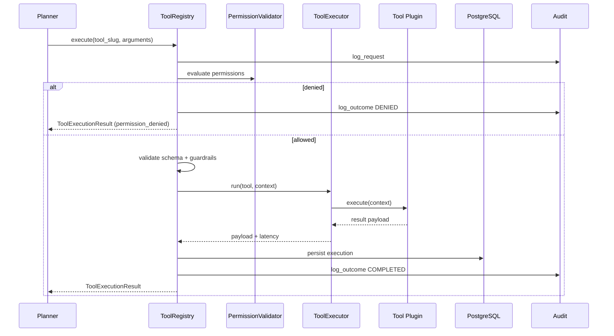

# Enterprise Tool Execution Framework

VOXERA's tool framework enables voice agents to execute real business operations — appointments, CRM updates, ticket creation, human transfer — with strict validation, tenant isolation, and full audit trails. The LLM **requests** actions; the backend **validates and executes** them.

## Architecture Diagram

```
┌─────────────────────────────────────────────────────────────────────────────┐
│        POST/GET /tenants/{tid}/agents/{aid}/tools/*                          │
└───────────────────────────────────┬─────────────────────────────────────────┘
                                    ▼
┌─────────────────────────────────────────────────────────────────────────────┐
│                         ToolRegistry (Planner's only port)                   │
│  list_tools · get_tool · execute · test · get_history · get_metrics          │
└───────┬───────────────┬────────────────┬────────────────┬───────────────────┘
        │               │                │                │
        ▼               ▼                ▼                ▼
┌──────────────┐ ┌──────────────┐ ┌─────────────┐ ┌─────────────────────────┐
│ Permission   │ │ Input +      │ │ ToolExecutor│ │ Audit + Metrics         │
│ Evaluator    │ │ Guardrails   │ │ Retry/CB    │ │ (immutable log)         │
└──────────────┘ └──────────────┘ └─────────────┘ └─────────────────────────┘
        │               │                │                │
        └───────────────┴────────────────┴────────────────┘
                                    ▼
                    ┌───────────────────────────────┐
                    │ Plugin Registry (12+ builtins) │
                    │ appointment · crm · webhook …  │
                    └───────────────────────────────┘
                                    ▼
                    ┌───────────────────────────────┐
                    │ ToolExecutionResult            │
                    │ → Planner → Memory (external)  │
                    └───────────────────────────────┘
```

## Execution Flow

```
Planner
   │
   ▼ Tool Request (JSON)
ToolRegistry
   │
   ├─ Permission validation (tenant policy, rate limits, working hours)
   ├─ Guardrails (no SQL/shell/filesystem/injection)
   ├─ JSON Schema validation
   │
   ▼
ToolExecutor (timeout · retry · circuit breaker)
   │
   ▼
Structured ToolExecutionResult
   │
   ▼
Audit log + execution history
   │
   ▼
Planner (forward result to MemoryManager.append_tool_result externally)
```

## Sequence Diagram



## Folder Structure

```
app/tools/
├── api/routes.py              # Execution REST API
├── registry/
│   ├── tool_registry.py       # ToolRegistry ABC
│   └── builtin_registry.py    # Plugin registration
├── interfaces/tool.py         # Tool plugin contract
├── adapters/                  # Built-in tool implementations
├── validators/                # Input, guardrails, access
├── execution/                 # Executor, retry, circuit breaker, timeout
├── permissions/               # (via validators/access_validator)
├── audit/                     # ToolAuditService
├── metrics/                   # ToolMetricsCollector
├── schemas/                   # CRUD + execution DTOs
└── repository/                # Repository ABCs

app/infrastructure/tools/
├── tool_registry.py           # ToolRegistryImpl
└── factory.py                 # DI wiring
```

## Tool Plugin Interface

Every tool implements:

| Method | Purpose |
|--------|---------|
| `name()` | Human-readable name |
| `slug()` | Registry key |
| `description()` | Planner tool selection |
| `parameters()` | JSON Schema |
| `permission_scope()` | Policy category |
| `execute(context)` | Business logic |
| `health()` | Dependency health |
| `validate(arguments)` | Custom validation |

**Adding a new tool:** create one class in `adapters/`, register in `builtin_registry.py`. No Planner or Registry changes required.

## Built-in Tools

| Slug | Scope |
|------|-------|
| `appointment` | Book/reschedule/cancel |
| `calendar` | Google/Outlook events |
| `email` | Transactional email |
| `sms` | SMS notifications |
| `crm_lookup` | Salesforce/HubSpot/Dynamics |
| `crm_update` | CRM record updates |
| `order_lookup` | Shopify/WooCommerce |
| `ticket_creation` | Zendesk/Freshdesk |
| `faq_search` | Knowledge FAQ |
| `human_transfer` | Call escalation |
| `identity_verification` | OTP/KBA/Twilio Verify |
| `webhook` | Allowlisted HTTP integrations |

## API Endpoints

Base: `/api/v1/tenants/{tenant_id}/agents/{agent_id}/tools`

| Method | Path | Description |
|--------|------|-------------|
| `GET` | `/` | List available tools |
| `GET` | `/{tool_slug}` | Tool definition |
| `POST` | `/test` | Validate without side effects |
| `POST` | `/execute` | Execute tool |
| `GET` | `/history` | Execution history |
| `GET` | `/metrics` | Observability snapshot |

Tool CRUD registry remains at `/api/v1/tenants/{tenant_id}/tools`.

## ToolExecutionResult

Every execution returns:

```json
{
  "status": "success",
  "tool_name": "Book Appointment",
  "tool_slug": "appointment",
  "execution_time_ms": 12.5,
  "result": { "appointment_id": "..." },
  "metadata": {},
  "warnings": [],
  "error": null,
  "timestamp": "2026-07-11T00:00:00Z",
  "conversation_id": "...",
  "tenant_id": "...",
  "agent_id": "...",
  "execution_id": "..."
}
```

## Security Guardrails

Blocked by design:

- Filesystem access
- SQL generation / execution
- Shell / Python execution
- Unknown tool names
- Unknown HTTP hosts (webhook allowlist)
- Cross-tenant data access
- Prompt injection patterns in arguments

## Configuration

```env
TOOL_EXECUTION_TIMEOUT_SECONDS=30
TOOL_MAX_RETRIES=3
TOOL_RETRY_BASE_DELAY_MS=200
TOOL_CIRCUIT_FAILURE_THRESHOLD=5
TOOL_CIRCUIT_RECOVERY_SECONDS=60
TOOL_RATE_LIMIT_PER_MINUTE=120
TOOL_ALLOWED_HTTP_HOSTS=api.example.com,hooks.example.com
TOOL_ENABLE_BUILTIN_TOOLS=true
```

## Developer Guide

### Execute a tool

```python
from app.tools.schemas.execution import ToolExecuteRequest

result = await tool_registry.execute(
    tenant_id,
    agent_id,
    ToolExecuteRequest(
        tool_slug="appointment",
        arguments={"action": "book", "customer_name": "Jane", "datetime": "2026-07-15T10:00:00Z"},
        conversation_id=session_id,
        idempotency_key="book-jane-001",
    ),
)
# Forward result to MemoryManager.append_tool_result() from Planner layer
```

### Create a plugin

```python
from app.tools.adapters.base import BuiltinTool
from app.tools.schemas.execution import ToolExecutionContext

class MyTool(BuiltinTool):
    def slug(self) -> str:
        return "my_tool"
    # ... implement interface ...

# Register in app/tools/registry/builtin_registry.py
```

## Migration

```bash
alembic upgrade head  # applies 004_enterprise_tool_framework
```

## What Was Not Modified

- Twilio / voice streaming pipeline
- STT / LLM / TTS consumers
- Enterprise Retrieval Engine (`app/rag/`)
- Memory Manager (`app/memory/`)

## Future Vision

Architecture supports horizontal scaling via:

- Redis-backed circuit breakers and rate limits
- Queue workers for async tool dispatch
- Distributed execution pools
- Provider adapters for Salesforce, HubSpot, Shopify, etc.
