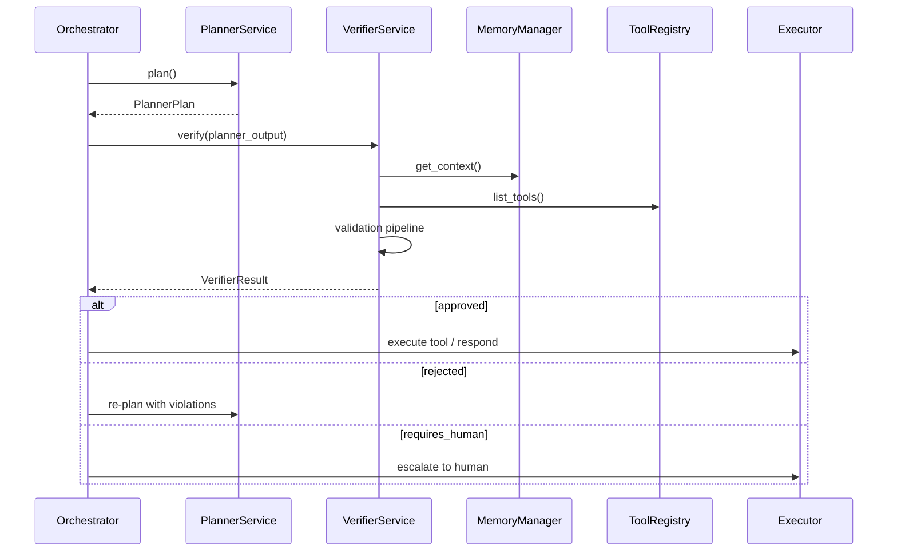

# Enterprise Verifier Agent

The Verifier Agent is VOXERA's enterprise trust layer. It validates every Planner decision **before execution** — it never talks to customers, never executes tools, and never solves problems.

## Mandatory Flow

```
Planner decides → Verifier validates → Executor executes
```

The Planner cannot bypass the Verifier.

## Architecture

```
┌─────────────────────────────────────────────────────────────────────────────┐
│              POST /tenants/{tid}/agents/{aid}/verifier/verify               │
└───────────────────────────────────┬─────────────────────────────────────────┘
                                    ▼
┌─────────────────────────────────────────────────────────────────────────────┐
│                         VerifierService                                      │
│  Reads: PlannerPlan + MemoryManager.get_context + ToolRegistry.list_tools   │
│  Never: ToolRegistry.execute · RAG · customer responses                      │
└───────┬───────────────┬────────────────┬────────────────┬───────────────────┘
        │               │                │                │
        ▼               ▼                ▼                ▼
┌──────────────┐ ┌──────────────┐ ┌─────────────┐ ┌─────────────────────────┐
│ JSON Schema  │ │ Policy +     │ │ Compliance  │ │ Risk Engine             │
│ Validation   │ │ Business     │ │ Engine      │ │ LOW/MEDIUM/HIGH/CRITICAL│
└──────────────┘ └──────────────┘ └─────────────┘ └─────────────────────────┘
                                    ▼
                    ┌───────────────────────────────┐
                    │ VerifierResult (strict JSON)   │
                    │ approve · reject · escalate    │
                    └───────────────────────────────┘
```

## Validation Pipeline

```
Planner Output
     │
     ▼
JSON Schema Validation
     │
     ▼
Tenant Policy Validation
     │
     ▼
Tool Argument Validation
     │
     ▼
Identity Validation
     │
     ▼
Conversation Validation
     │
     ▼
Knowledge Validation
     │
     ▼
Hallucination Detection
     │
     ▼
Business Rule Engine
     │
     ▼
Compliance Layer (GDPR, HIPAA, PCI-DSS, SOC2, ISO27001)
     │
     ▼
Risk Engine → Approve / Reject / Escalate
```

## Risk Engine

| Risk | Examples | Action Rule |
|------|----------|-------------|
| LOW | FAQ, appointment booking | Auto-approve |
| MEDIUM | Address change, tickets | May require confirmation |
| HIGH | Refund, CRM update | Require identity verification |
| CRITICAL | Emergency, bank transfer | Human approval |

## Verifier Output

```json
{
  "approved": true,
  "outcome": "approved",
  "risk": "low",
  "requires_confirmation": false,
  "requires_human": false,
  "reason": null,
  "corrected_tool_arguments": {"email": "customer@email.com"},
  "warnings": [],
  "violations": [],
  "compliance_passed": true,
  "risk_score": 0.2
}
```

## Sequence Diagram



## Folder Structure

```
app/verifier/
├── api/routes.py           # REST endpoints
├── services/               # VerifierService port
├── interfaces/             # VerifierModel ABC
├── models/                 # StructuredVerifierModel
├── validators/             # JSON, tool, identity, hallucination, pipeline
├── policies/               # Tenant policy, business rules, risk engine
├── compliance/             # GDPR, HIPAA, PCI-DSS, SOC2, ISO27001
├── audit/                  # Immutable audit trail
├── cache/                  # VerifierCache (Redis-ready)
├── metrics/                # Observability
├── prompts/                # Safety prompt templates
└── schemas/                # VerifierInput, VerifierResult
```

## API Endpoints

Base: `/api/v1/tenants/{tenant_id}/agents/{agent_id}/verifier`

| Method | Path | Description |
|--------|------|-------------|
| `POST` | `/verify` | Validate planner output |
| `GET` | `/history` | Audit history |
| `GET` | `/metrics` | Observability snapshot |

## Configuration

```env
VERIFIER_CACHE_TTL_SECONDS=300
VERIFIER_ENABLE_CACHE=true
VERIFIER_MIN_CONFIDENCE=0.50
VERIFIER_KNOWLEDGE_MIN_SIMILARITY=0.65
VERIFIER_MODEL_PROVIDER=structured
VERIFIER_REFUND_HUMAN_THRESHOLD_USD=500
VERIFIER_AUTO_APPROVE_LOW_RISK=true
```

## Developer Guide

```python
from app.verifier.schemas import VerifyRequest

verification = await verifier_service.verify(
    tenant_id, agent_id,
    VerifyRequest(
        conversation_id=session_id,
        planner_output=plan,
        tenant_policies={
            "blocked_tools": ["webhook"],
            "compliance_frameworks": ["gdpr", "soc2"],
            "business_rules": [
                {"type": "refund_threshold", "threshold": 500},
                {"type": "customer_inactive"},
            ],
        },
    ),
)

if not verification.approved:
    # Re-plan or escalate — do NOT execute
    ...
elif verification.requires_human:
    # Human approval gate
    ...
else:
    # Safe to execute with corrected_tool_arguments
    await tool_registry.execute(...)
```

## Migration

```bash
alembic upgrade head  # applies 006_enterprise_verifier
```

## Unmodified Systems

- Voice streaming pipeline
- Memory Manager implementation
- Tool Registry implementation
- Planner Agent implementation
- Enterprise RAG engine
