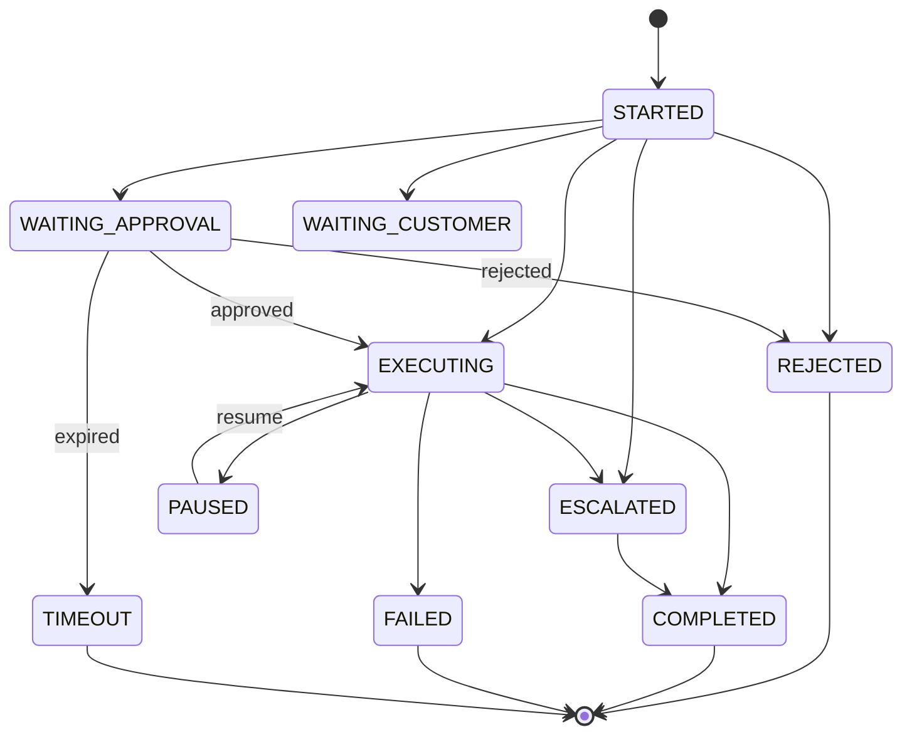
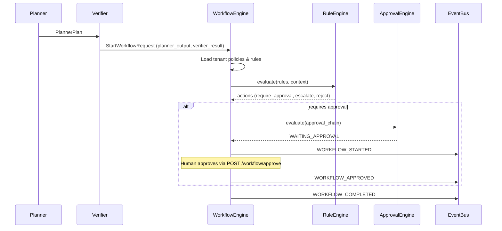

# Enterprise Workflow & Policy Engine

The Workflow Engine is VOXERA's configuration-driven business rules layer. Every tenant defines policies, approvals, escalation rules, routing, and business hours **without code changes**.

## Mandatory Flow

```
Customer Call → Planner → Verifier → Workflow Engine → Business Rules → Approve → Execute Tool → Notify → Complete
```

The Workflow Engine receives `planner_output` and `verifier_result` externally — it does not call Planner or Verifier internally.

## Architecture

```
┌─────────────────────────────────────────────────────────────────────────────┐
│         POST /tenants/{tid}/agents/{aid}/workflow                           │
└───────────────────────────────────┬─────────────────────────────────────────┘
                                    ▼
┌─────────────────────────────────────────────────────────────────────────────┐
│                         WorkflowService / WorkflowEngineImpl                 │
│  Load tenant workflows · Evaluate rules · Execute · Pause · Approve · Escalate │
└───────┬───────────────┬────────────────┬────────────────┬───────────────────┘
        │               │                │                │
        ▼               ▼                ▼                ▼
┌──────────────┐ ┌──────────────┐ ┌─────────────┐ ┌─────────────────────────┐
│ PolicyEngine │ │ RuleEngine   │ │ ApprovalEng │ │ EscalationEngine        │
│ Hours·VIP·   │ │ IF/THEN/ELSE │ │ Auto·2-step │ │ Human·SMS·Webhook·Slack │
│ Refund caps  │ │ Configurable │ │ Time-limited│ │ Context preservation    │
└──────────────┘ └──────────────┘ └─────────────┘ └─────────────────────────┘
        │               │                │                │
        ▼               ▼                ▼                ▼
┌──────────────┐ ┌──────────────┐ ┌─────────────┐ ┌─────────────────────────┐
│ RoutingEngine│ │ Scheduler    │ │ EventBus    │ │ PluginRegistry          │
│ Dept·VIP·    │ │ TZ·Holidays  │ │ Event-driven│ │ notify·complete·custom  │
│ Emergency    │ │ Appointments │ │ Audit trail │ │ Auto-register actions   │
└──────────────┘ └──────────────┘ └─────────────┘ └─────────────────────────┘
```

## Workflow States

| State | Description |
|-------|-------------|
| `STARTED` | Workflow initiated |
| `WAITING_APPROVAL` | Pending manager/finance approval |
| `WAITING_IDENTITY` | Identity verification required |
| `WAITING_CUSTOMER` | Paused for customer (e.g. outside hours) |
| `EXECUTING` | Active execution |
| `PAUSED` | Manually paused |
| `COMPLETED` | Successfully finished |
| `FAILED` | Execution failed |
| `ESCALATED` | Escalated to human/supervisor |
| `TIMEOUT` | Approval or execution timed out |
| `REJECTED` | Rejected by rule or approver |

## State Diagram



## Sequence Diagram



## Business Rule Guide

Rules use IF/THEN/ELSE with configurable conditions and actions.

### Example: High Refund Requires Manager Approval

```json
{
  "name": "high_refund",
  "priority": 10,
  "conditions": [
    {"field": "refund_amount", "operator": "gt", "value": 500}
  ],
  "actions": [
    {"type": "require_approval", "params": {"role": "manager"}}
  ]
}
```

### Example: VIP Priority Routing

```json
{
  "name": "vip_routing",
  "priority": 5,
  "conditions": [
    {"field": "customer_tier", "operator": "eq", "value": "vip"}
  ],
  "actions": [
    {"type": "route", "params": {"queue": "vip-priority"}}
  ]
}
```

### Example: Healthcare Emergency Escalation

```json
{
  "name": "healthcare_emergency",
  "priority": 1,
  "conditions": [
    {"field": "planner_output.intent", "operator": "eq", "value": "emergency"}
  ],
  "actions": [
    {"type": "escalate", "params": {"target": "emergency_queue", "reason": "Healthcare emergency"}}
  ]
}
```

### Supported Operators

`eq`, `ne`, `gt`, `gte`, `lt`, `lte`, `in`, `not_in`, `contains`

### Supported Actions

`require_approval`, `reject`, `escalate`, `route`, `execute`, `notify`, `pause`, `complete`, `bypass_auth`

## Tenant Policy Configuration

Policies are stored per tenant in `BusinessPolicyModel`:

| Policy | Example |
|--------|---------|
| Working hours | `09:00`–`17:00` Europe/Berlin |
| Holidays | `["2026-12-25"]` |
| Max refund | `500` |
| Max discount | `20` |
| VIP rules | `{"customer_ids": ["cust-123"]}` |
| Allowed/blocked tools | Tool permission lists |
| Escalation threshold | Confidence floor |

## Approval Chains

```json
{
  "approval_chain": [
    {"role": "supervisor", "mode": "manager"},
    {"role": "finance", "mode": "department", "timeout_seconds": 3600}
  ]
}
```

Modes: `auto`, `manager`, `department`, `two_step`, `time_limited`

## Escalation Targets

`human_agent`, `supervisor`, `department`, `emergency_queue`, `sms`, `email`, `webhook`, `slack`, `teams`

Escalation preserves: conversation, memory, transcript, tool history, reasoning summary.

## Plugin System

Register custom workflow actions without modifying `WorkflowEngine`:

```python
from app.workflow.engine.plugins import WorkflowActionPlugin, WorkflowPluginRegistry

class SendSmsPlugin(WorkflowActionPlugin):
    def action_type(self) -> str:
        return "send_sms"

    async def execute(self, params, context):
        # implementation
        ...

registry = WorkflowPluginRegistry()
registry.register(SendSmsPlugin())
```

## API Reference

| Method | Path | Description |
|--------|------|-------------|
| POST | `/workflow` | Start workflow execution |
| POST | `/workflow/definitions` | Create workflow definition |
| GET | `/workflow` | List tenant workflows |
| GET | `/workflow/{id}` | Get workflow by ID |
| GET | `/workflow/templates` | List workflow templates |
| POST | `/workflow/test` | Dry-run rules against context |
| POST | `/workflow/validate` | Validate workflow definition |
| POST | `/workflow/approve` | Approve/reject pending step |
| POST | `/workflow/advance` | Advance workflow with context updates |
| GET | `/workflow/history` | Audit history by conversation |
| GET | `/workflow/metrics/snapshot` | Observability metrics |

## Database Schema

| Table | Purpose |
|-------|---------|
| `workflows` | Workflow definitions (versioned, tenant-scoped) |
| `workflow_executions` | Runtime execution state |
| `workflow_rules` | Tenant business rules |
| `workflow_approvals` | Approval records |
| `workflow_escalations` | Escalation records with context snapshots |
| `business_policies` | Tenant policy configuration |
| `routing_rules` | Department/skill/VIP routing |
| `workflow_audit` | Full audit trail |

Migration: `007_enterprise_workflow_schema`

## Observability

Metrics tracked: workflow duration, approval time, escalation rate, success/failure rate, policy violations, average steps, average wait time.

## Multi-Tenant Isolation

Every tenant owns workflows, policies, departments, approval chains, and routing rules. `WorkflowAccessValidator` enforces tenant and agent scope on all operations.

## Future Ready

Designed for: visual workflow builder, no-code editor, AI-generated workflows, BPMN import, workflow marketplace, distributed workers, queue processing, workflow versioning.

## Folder Structure

```
app/workflow/
├── api/           # REST routes
├── engine/        # WorkflowEngine port, event bus, plugins
├── policy/        # PolicyEngine
├── rules/         # RuleEngine (IF/THEN/ELSE)
├── approvals/     # ApprovalEngine
├── escalation/    # EscalationEngine
├── routing/       # RoutingEngine
├── scheduler/     # Business hours & holidays
├── validators/    # Definition & access validation
├── execution/     # (future distributed workers)
├── repository/    # Repository ports
├── services/      # WorkflowService facade
├── schemas/       # Pydantic models
├── metrics/       # Metrics collector
└── audit/         # Audit service
```
